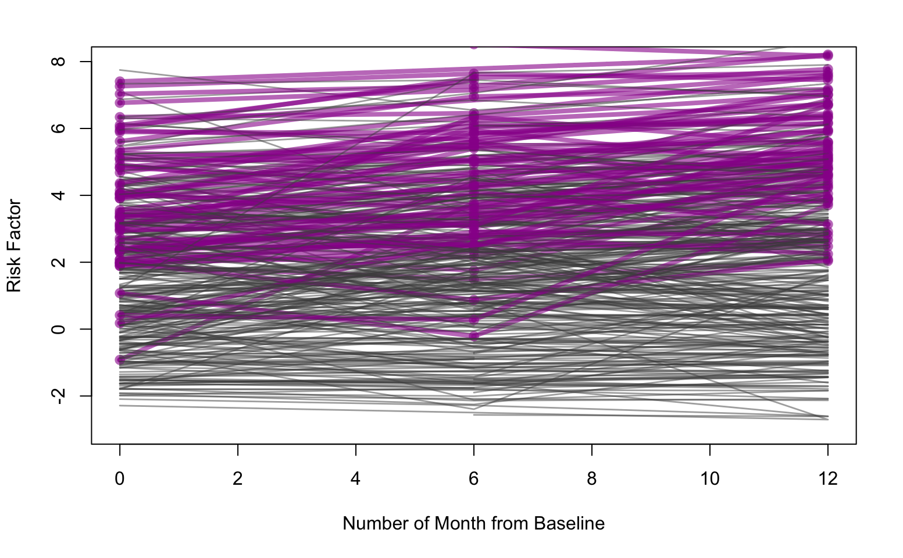
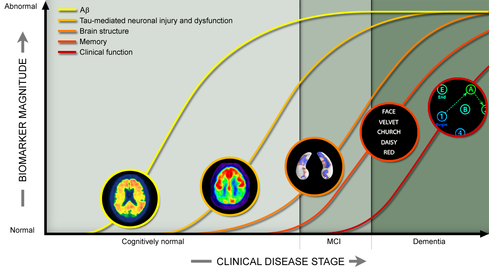

---
output:
  pdf_document: 
    fig_caption: yes
  html_document:
    highlight: pygments
    theme: spacelab
---

```{r setup, include=FALSE, echo = FALSE}
knitr::opts_chunk$set(echo = TRUE, fig.pos = 'h', fig.align = 'center')
knitr::opts_chunk$set(fig.cap = "",  fig.path = "Plot")
library(knitr)
library(dplyr)
library(ggplot2)
library(arm)
library(pROC)
library(tidyverse)
library(MASS)
library(tigerstats)
library(leaps)
library(car)
library(rms)
require(caret)
require(e1071)
library(broom)
library(rlang)
library(qwraps2)
library(gridExtra)
```


## Alzheimer's Disease Pathological Phases and Biomarkers: A Statistical Analysis


## Executive Summary
In this project, we give comprehensive analysis on Alzheimer's disease data. A model to classify different Alzheimer's phases (Normal, Mild Cognitive Impairment, and Dementia) is developed using proportional odds ratio technique. Risk score is proposed and shown that people who had Mild Cognitive Impairment and progressed to Dementia within a year, on average, had higher score. Finally, a regression model to explain variability in Hippocampal volume of patients is discussed.

## Introduction 
Introduced in 1910, Alzheimer’s disease is developed through an irreversible process spanning across several years. Patients typically experience memory loss, impaired cognitive ability, language problems, and stress[1]. Even though over 5.8 million Americans are suffering from it[2], our capability in accurately screening is still limited especially for Mild Cognitive Impairment (MCI), the early stage of the disease, leading to late treatment.

Moreover, the diagnostic process also involves several metrics and subjective components including standardized test (Mini-Mental State Exam MMSE) which is not sensitive for MCI [3,4], interviews, and sometimes CT, MRI or PET scan for biomarkers to determine the progress of the disease [5]. To contribute to this area, three main objectives will be addressed in this project.

1. To build statistical models based on simple neuropsychological tests that could be administered online to predict Alzheimer's phases in patients, and compare their predictive capability with other methods proposed within research community.  

2. To construct a risk score metric using the model in the first section in capturing the potential conversion to more severe states of Alzheimer's in the future.

3. To investigate the capability of these basic tests in estimating some of the biomarkers that have been believed to play major roles in the progression of the disease [6].

```{r, echo = FALSE, include=FALSE}
df <- read_csv("Data/ADNIMERGE.csv") 
FAQ_breakdown <- read_csv("Data/FAQ_breakdown.csv")

#subset variables of interest
df <- df[df$VISCODE == 'bl', c('RID','COLPROT','DX', 'PTAU', 'Hippocampus', 'ABETA', 
                               'AGE', 'PTGENDER', 'PTEDUCAT', 'PTMARRY', 'CDRSB', 
                               'ADAS13', 'MMSE', 'RAVLT_perc_forgetting_bl', 'FAQ', 
                               'MOCA', 'DIGITSCOR', 'VSWEIGHT','VSHEIGHT' )]

#Convert variables into factors
df$DX <- ordered(df$DX, levels = c('CN','MCI', 'Dementia'))
df$PTGENDER <- factor(df$PTGENDER, levels = c('Female', 'Male'))
df$PTMARRY <- factor(df$PTMARRY)
df$Partner <- factor(df$PTMARRY == 'Married')
df <- rename(df, RAVLT= RAVLT_perc_forgetting_bl)
df <-rename(df, DSST= DIGITSCOR)
```

```{r, echo = FALSE, include=FALSE}
#Phase 1: Prediction Alzheimer's Phase 

#Subset ADNI1 data
df_subset <- na.omit(df[, c('RID', 'COLPROT', 'DX', 'AGE', 'PTGENDER','VSWEIGHT', 
                                  'VSHEIGHT', 'PTEDUCAT', 'Partner','CDRSB', 'ADAS13', 
                                  'MMSE', 'RAVLT',
                                  'FAQ', 'DSST')])
phase1 <- merge(df_subset, FAQ_breakdown, by = 'RID')

#Some rows have negative RAVLT score and FAQ score
phase1 <- phase1[phase1$RAVLT >=0,]
phase1 <- phase1[phase1$FAQBEVG>=0,]


```

## Data and Exploratory Data Analysis

The data was provided by The Alzheimer’s Disease Neuroimaging Initiative (ADNI) with more than 14,000 records of 115 variables. In this project, we focus on ADNI1 cohort (797 participants). The variables being investigated include demographic information of participants, longitudinal diagnostic results, biomarkers, and Neuropsychological test results [7]. For the diagnosis, each person was classified into one of the three groups: Control Normal (CN), Mild Cognitive Impairment (MCI), or Dementia (AD). The full data dictionary is provided in the appendix section.

The neuropsychological tests explored in this project included:

1. Rey Auditory Verbal Learning Test (RAVLT): an auditory-verbal memory test where high score indicates high rate of forgetting[8]

2. Digit Symbol Substitution Test (DSST): a symbol matching test where low score means impaired coginitive skill[9]

3. Functional Activities Questionnaire (FAQ): a questionnaire for an informant about patient's ability to do daily tasks alone in which high score means being dependent[10]

In the data cleaning process, some negative RAVLT scores are found and the records are removed. Moreover, the unit of height measurement is not consistent across the population noted from clear bimodal distribution. The summary statistics of some key variables are reported in Table 1 below.

\begin{table}[]
\caption{Summary Statistics of Some Candidate Predictors}
\begin{center}
\begin{tabular}{l|l|l|l}
\hline
 & DX: CN (N = 217) & DX: MCI (N = 385) & DX: Dementia (N = 181)\\
\hline
\bf{Age} & ~ & ~ & ~\\
~~ min & 59.9 & 54.4 & 55.1\\
~~ max & 89.6 & 89.3 & 90.9\\
~~ mean (sd) & 75.98 $\pm$ 5.10 & 74.75 $\pm$ 7.36 & 75.32 $\pm$ 7.40\\
\hline
\bf{MMSE} & ~ & ~ & ~\\
~~ min & 25 & 23 & 20\\
~~ max & 30 & 30 & 28\\
~~ mean (sd) & 29.10 $\pm$ 0.99 & 27.03 $\pm$ 1.79 & 23.40 $\pm$ 2.03\\
\hline
\bf{RAVLT} & ~ & ~ & ~\\
~~ min & 0 & 0 & 0\\
~~ max & 100 & 100 & 100\\
~~ mean (sd) & 36.72 $\pm$ 24.87 & 68.77 $\pm$ 30.27 & 88.32 $\pm$ 22.24\\
\hline
\bf{DSST} & ~ & ~ & ~\\
~~ min & 18 & 5 & 0\\
~~ max & 80 & 69 & 62\\
~~ mean (sd) & 45.84 $\pm$ 10.14 & 36.85 $\pm$ 11.12 & 26.99 $\pm$ 12.78\\
\hline
\bf{FAQ} & ~ & ~ & ~\\
~~ min & 0 & 0 & 0\\
~~ max & 6 & 21 & 30\\
~~ mean (sd) & 0.14 $\pm$ 0.61 & 3.83 $\pm$ 4.49 & 12.92 $\pm$ 6.82\\
\hline
\end{tabular}
\end{center}
\end{table}
```{r, echo = FALSE, include = FALSE}
data_summary <-
  list("Age" =
       list("min" = ~ min(.data$AGE),
            "max" = ~ max(.data$AGE),
            "mean (sd)" = ~ qwraps2::mean_sd(.data$AGE)),
       "MMSE" =
       list("min" = ~ min(.data$MMSE),
            "max" = ~ max(.data$MMSE),
            "mean (sd)" = ~ qwraps2::mean_sd(.data$MMSE)),
       "RAVLT" =
       list("min" = ~ min(.data$RAVLT),
            "max" = ~ max(.data$RAVLT),
            "mean (sd)" = ~ qwraps2::mean_sd(.data$RAVLT)),
       "DSST" =
       list("min" = ~ min(.data$DSST),
            "max" = ~ max(.data$DSST),
            "mean (sd)" = ~ qwraps2::mean_sd(.data$DSST)),
       "FAQ"=
       list("min" = ~ min(.data$FAQ),
            "max" = ~ max(.data$FAQ),
            "mean (sd)" = ~ qwraps2::mean_sd(.data$FAQ)))

print(summary_table(dplyr::group_by(phase1, DX), data_summary))
```
\newpage

For exploratory data analysis, we utilized boxplots (Figure 1) and density plots to examine the possibility of using the variables we had in predicting Alzheimer's phases. For RAVLT score, the higher score indicates less ability to recall words after a certain period of time, hence, a decline in cognitive ability. DSST score indicates how fast participants can match the symbols with digits; therefore, higher scores pose less probability of having cognitive problem.


```{r, echo = FALSE, fig.height = 1.75, fig.cap="Boxplots showing distributions of auditory score (RAVLT) and digit substitution score (DSST) of applicants with different ALzheimer's periods"}
box1 <-ggplot(data = phase1) + geom_boxplot(aes(y = RAVLT,x = DX, fill = DX)) + xlab(NULL) + ylab('RAVLT')+ theme(legend.position = "none")

box2 <-ggplot(data = phase1) + geom_boxplot(aes(y = DSST,x = DX, fill = DX)) + xlab(NULL) + ylab('DSST')+ theme(legend.position = "none")
grid.arrange(box1, box2, ncol = 2)
```

Binned plots were used to study the probability of being in different phases for different predictor bins and are reported in the appendix (Figure 4). We found that the probability trend follows the sigmoid shape; moreover, the probability of being in CN and that of being in CN or MCI are similar in shape indicating that the Proportional odds model may be a suitable option.

```{r, echo = FALSE, include = FALSE}
#EDA
ggplot(data = phase1) + geom_boxplot(aes(y = FAQ, col = DX))
ggplot(data = phase1) + geom_boxplot(aes(y = DSST, col = DX))
ggplot(data = phase1) + geom_boxplot(aes(y = RAVLT, col = DX))

#binned plot to evaluate the inverse logit: FAQ
binnedplot(y=phase1$DX == 'CN',phase1$FAQ,xlab="sqrt.FAQ",
           ylim=c(0,1),col.pts="navy", ylab ="Prob(<=CN)",col.int="white")
binnedplot(y=phase1$DX != 'Dementia',phase1$FAQ,xlab="sqrt.FAQ",
           ylim=c(0,1),col.pts="navy", ylab ="Prob(<=MCI)",col.int="white")

#binned plot to evaluate the inverse logit: DSST
binnedplot(y=phase1$DX == 'CN',phase1$DSST,xlab="Digit Substitution Score",
           ylim=c(0,1),col.pts="navy", ylab ="Prob(<=CN)",col.int="white")
binnedplot(y=phase1$DX != 'Dementia',phase1$DSST,xlab="Digit Substitution Score",
           ylim=c(0,1),col.pts="navy", ylab ="Prob(<=MCI)",col.int="white")

#binned plot to evaluate the inverse logit: RAVLT
binnedplot(y=phase1$DX == 'CN',phase1$RAVLT,
           xlab="RAVLT Percent Forgetting", ylim=c(0,1),col.pts="navy", 
           ylab ="Prob(<=CN)",col.int="white")
binnedplot(y=phase1$DX != 'Dementia',phase1$RAVLT,
           xlab="RAVLT Percent Forgetting", ylim=c(0,1),col.pts="navy", 
           ylab ="Prob(<=MCI)",col.int="white")

#binned plot to evaluate the inverse logit: ADAS13
binnedplot(y=phase1$DX == 'CN',phase1$ADAS13,
           xlab="ADAS-13", ylim=c(0,1),col.pts="navy", 
           ylab ="Prob(<=CN)",col.int="white")
binnedplot(y=phase1$DX != 'Dementia',phase1$ADAS13,
           xlab="ADAS-13", ylim=c(0,1),col.pts="navy", 
           ylab ="Prob(<=MCI)",col.int="white")

#binned plot to evaluate the inverse logit: FAQSHOP
binnedplot(y=phase1$DX == 'CN',phase1$FAQSHOP,
           xlab="ADAS-13", ylim=c(0,1),col.pts="navy", 
           ylab ="Prob(<=CN)",col.int="white")
binnedplot(y=phase1$DX != 'Dementia',phase1$FAQSHOP,
           xlab="ADAS-13", ylim=c(0,1),col.pts="navy", 
           ylab ="Prob(<=MCI)",col.int="white")

#binned plot to evaluate the inverse logit: FAQGAME
binnedplot(y=phase1$DX == 'CN',phase1$FAQGAME,
           xlab="ADAS-13", ylim=c(0,1),col.pts="navy", 
           ylab ="Prob(<=CN)",col.int="white")
binnedplot(y=phase1$DX != 'Dementia',phase1$FAQGAME,
           xlab="ADAS-13", ylim=c(0,1),col.pts="navy", 
           ylab ="Prob(<=MCI)",col.int="white")

#binned plot to evaluate the inverse logit: FAQEVENT
binnedplot(y=phase1$DX == 'CN',phase1$FAQEVENT,
           xlab="ADAS-13", ylim=c(0,1),col.pts="navy", 
           ylab ="Prob(<=CN)",col.int="white")
binnedplot(y=phase1$DX != 'Dementia',phase1$FAQEVENT,
           xlab="ADAS-13", ylim=c(0,1),col.pts="navy", 
           ylab ="Prob(<=MCI)",col.int="white")
```

Some other notices are the normality of Hippocampal Volume, one of the key biomarkers, including moderate linear association with some of our test scores. For other biomarkers such as Amyloid beta (ABETA), the amino acids causing plaques in brains, and phosphorylated tau (P-tau or PTAU), proteins which if defective can lead to neurons' death, they show weak linear relationship with predictors.

\newpage
### Model Part I: Alzheimer's Phase Prediction
The proportional odds model is used to predict Alzheimer's Phases in participants. We split the data into training and test set (75%:25%). All demographic data and three test variables (RAVLT, DSST, and FAQ) are included. Then, stepwise feature selection using BIC as the criteria is adopted. Finally, interaction terms and transformation are tested in term of the predictive capability. 

According to model coefficients (after being exponentiated) in Table 2, the model only depends on three types of tests which are all significant at the 0.05 significance level. 

```{r, echo = FALSE}
#Part 1.1: Using FAQ, DSST, and RAVLT to predict Alzheimer's Phase
phase1$sqrt.FAQ <- sqrt(phase1$FAQ)
#Standardized our predictors

phase1$FAQFINAN <- scale(phase1$FAQFINAN)
phase1$FAQFORM <- scale(phase1$FAQFORM)
phase1$FAQSHOP <- scale(phase1$FAQSHOP)
phase1$FAQGAME <- scale(phase1$FAQGAME)
phase1$FAQBEVG <- scale(phase1$FAQBEVG)
phase1$FAQMEAL <- scale(phase1$FAQMEAL)
phase1$FAQEVENT <- scale(phase1$FAQEVENT)
phase1$FAQTV <- scale(phase1$FAQTV)
phase1$FAQREM <- scale(phase1$FAQREM)
phase1$FAQTRAVL <- scale(phase1$FAQTRAVL)
#Take sqrt of FAQ to fix for large value causing predicting prob of 1
#phase1$FAQ <- phase1$FAQ^0.5

#1. Train-Test-Split 75%:25%
set.seed(5)
ind <- sample(c(TRUE, FALSE), dim(phase1)[1], replace=TRUE, prob=c(0.75, 0.25))
phase1_training <- phase1[ind,]
phase1_testing <- phase1[!ind,]

phase1_basemodel <- polr(DX ~ DSST + RAVLT +sqrt.FAQ + 
                           AGE+ PTGENDER + PTEDUCAT, data=phase1_training)

#2. Model using Ordered logistic regression
phase1_fullmodel <- polr(DX ~ (DSST + RAVLT +sqrt.FAQ)^2 + 
                           AGE+ PTGENDER + PTEDUCAT, data=phase1_training)


#3. Perform BIC stepwise selection
phase1_step <- step(phase1_fullmodel ,direction="both",trace=0, 
                    k = log(dim(phase1_training)[1]))

#4. Summarize final model for this part
kable(tidy(phase1_step, exponentiate = T), digit = 3, caption = "Coefficients of the Model to Predict Alzheimer's Phases")

#5. Compare with the base model: not significant at 0.05 significance level
#anova(phase1_step, phase1_basemodel, test= "Chisq")
```
  
For the model assessment and evaluation, binned plots of the raw residuals versus the fitted probability on the test set is used. For most part, the binned residuals have no clear pattern.

To assess the generalizability, the AUC of the model on the test set was computed. The CN and Dementia cases can be almost perfectly separable (0.999). We also obtained reasonable AUC for separating CN from MCI (0.882) and MCI from Dementia (0.888). We compared our model AUC with that from other researcher that use the same data set and summarized all findings in the Table 3.  

\begin{table}[h]
\caption{AUC of classification models to predict different phases of Alzheimer's disease}
\begin{center}
\begin{tabular}{|lllll|}
\hline
Sources & Input Data & Techniques & CN/AD & CN/MCI  \\ \hline
Fan Li(2018)[10] & MRI Image & ResNet &  0.90 & 0.72 \\ 
Fan Li(2018)[10] & MRI Image & DenseNet & 0.92 & 0.78  \\ 
Andres Ortiz(2018)[11] & MRI Image + PET & Ensemble of SVM & 0.96 & 0.82  \\ 
Bo Cheng(2018)[12] & MRI Image + CFS & SVM & 0.98 & 0.87  \\ 
Alden L.(2016)[13] & Cognitive tests + Biomarkers & Logistic Regression &0.98 & 0.88  \\ 
This project & Cognitive tests & Proportional odds & 0.99 & 0.88  \\ \hline
\end{tabular}
\end{center}
\end{table}

Our model is comparable to those used similar techniques like logistic regression and better than a more complicated techniques like convolutional neural network. This is probably because the small size of the data set cannot accommodate the use of highly flexible models.

```{r, echo = FALSE, include= FALSE}
##Part 1.2: Model Assessment and Evaluation: residual plots

##Calculate residual
rawresid1 <- (phase1_training$DX== 'CN') -  fitted(phase1_step)[,1]
rawresid2 <- (phase1_training$DX!= 'Dementia') -  rowSums(fitted(phase1_step)[,1:2])

##binned plots for continuous variables
par(mfrow = c(1,2))
binnedplot(fitted(phase1_step)[,1], rawresid1, xlab = "fitted value", ylab = "Raw residuals", main = "Binned plot: CN")
binnedplot(rowSums(fitted(phase1_step)[,1:2]), rawresid2, xlab = "fitted value", ylab = "Raw residuals", main = "Binned plot: CN + MCI")
```

As the FAQ score is predictive, we further investigates the subscores of FAQ which targeted at ten different tasks in daily life such as the ability of applicants in preparing meals [14]. These subscores are incorporated into the modelling strategy and the stepwise feature selection using BIC is used to obtain the final model.

Out of the ten subscores, four of them are included in the final model and including the others doesn't further improve the performance. These tasks are completing forms, preparing meals, remembering appointments, and traveling out of the neighborhood. It is possible that these impairments are relatively easy to observe by relatives. The benefits here is to possibly reduce the number of questions in the FAQ or target at these areas while conducting interview.

```{r, echo = FALSE, fig.height =3, fig.width=5, include = FALSE}
##Part 1.2: Model Assessment and Evaluation: test set performance

#Prediction on test set
predict_test <- predict(phase1_step, phase1_testing, type = 'probs')
ind_notCN <- phase1_testing$DX!='CN'
ind_notMCI <- phase1_testing$DX!='MCI'
ind_notAD <- phase1_testing$DX!='Dementia'
pred_CN <- predict_test[,1]
pred_MCI <- predict_test[,2]
pred_AD <- predict_test[,3]

#Normal vs Dementia
par(mfrow = c(1,3))
roc1 <- roc(phase1_testing$DX, pred_AD/(pred_AD+ pred_CN),
    plot=T,print.thres="best",legacy.axes=T,print.auc =T,col="red3", levels = c('CN', 'Dementia'))

#Normal vs MCI
roc2 <- roc(phase1_testing$DX, pred_MCI/(pred_MCI+ pred_CN),
    plot=T,print.thres="best",legacy.axes=T,print.auc =T,col="red3", levels = c('CN', 'MCI'))

#MCI vs Dementia
roc3 <- roc(phase1_testing$DX, pred_AD/(pred_AD+ pred_MCI),
    plot=T,print.thres="best",legacy.axes=T,print.auc =T,col="red3", levels = c('MCI', 'Dementia'))
```


```{r, warning = FALSE, echo = FALSE, include = FALSE}
#Part 1.3: Using breakdown score of FAQ to predict Alzheimer's Phase

#Ordered logistic regression
phase1_FAQbd <- polr(DX ~ (DSST + RAVLT + AGE + 
                                 FAQFINAN + FAQFORM + FAQSHOP + FAQGAME +
                                 FAQBEVG + FAQMEAL + FAQEVENT + FAQTV + 
                                 FAQREM + FAQTRAVL + PTGENDER + PTEDUCAT),
                         data=phase1_training)

#BIC stepwise selection
phase1_FAQbd_step <- step(phase1_FAQbd ,direction="both",trace=0, 
                    k = log(dim(phase1_training)[1]))

#Summarize final model for this part
summary(phase1_FAQbd_step)
```

```{r, warning = FALSE, echo = FALSE, include = FALSE}
#Part 1.4: Model Assessment and Evaluation
#Prediction on test set
predict_test <- predict(phase1_FAQbd_step, phase1_testing, type = 'probs')
ind_notCN <- phase1_testing$DX!='CN'
ind_notMCI <- phase1_testing$DX!='MCI'
ind_notAD <- phase1_testing$DX!='Dementia'
pred_CN <- predict_test[,1]
pred_MCI <- predict_test[,2]
pred_AD <- predict_test[,3]

#Normal vs Dementia
roc(phase1_testing$DX, pred_AD/(pred_AD+ pred_CN),
    plot=T,print.thres="best",legacy.axes=T,print.auc =T,col="red3", levels = c('CN', 'Dementia'))

#Normal vs MCI
roc(phase1_testing$DX, pred_MCI/(pred_MCI+ pred_CN),
    plot=T,print.thres="best",legacy.axes=T,print.auc =T,col="red3", levels = c('CN', 'MCI'))

#MCI vs Dementia
roc(phase1_testing$DX, pred_AD/(pred_AD+ pred_MCI),
    plot=T,print.thres="best",legacy.axes=T,print.auc =T,col="red3", levels = c('MCI', 'Dementia'))
```


### Model Part II: Risk Score for Alzheimer's Disease

Unfortunately, rigorous classification modelling cannot be applied because of two reasons. Firstly, not all patients had a consistent follow-up. Secondly, pathologically, the conversion rate for normal people to MCI is about 6% per year[15] and ADNI has not followed people long enough. Therefore, researchers mostly treated ADNI1 data as a cross-sectional study[13].

Despite these facts, exploring potential characteristics in the converted group is still possible for MCI turning to Dementia. We start by defining the risk score using coefficients from the first model. We posit a hypothesis that people who are relatively more likely to have Dementia and yet was still at MCI might be more likely to convert in the near future. The risk score is reported below.
$$
risk score = -0.047*DSST + 0.023*RAVLT + 1.427*\sqrt{FAQ}
$$

```{r, warning=FALSE, include = FALSE, echo = FALSE}
#Phase 2: The use of severity score as a tracker for Alzheimer's progression
phase2 <- read_csv("Data/ADNIMERGE.csv") 

#subset variables of interest
phase2 <- na.omit(phase2[phase2$COLPROT == 'ADNI1', c('RID', 'VISCODE','DX', 'AGE',
                                                      'PTGENDER',
                                                      'RAVLT_perc_forgetting_bl',
                                                      'FAQ', 'DIGITSCOR')])
phase2 <- rename(phase2, RAVLT= RAVLT_perc_forgetting_bl)
phase2 <-rename(phase2, DSST= DIGITSCOR)
#Convert variables into factors
phase2$DX <- ordered(phase2$DX, levels = c('CN','MCI', 'Dementia'))
phase2$RID <- as.factor(phase2$RID)
#Some rows have negative RAVLT score and FAQ score
phase2 <- phase2[phase2$RAVLT >=0,]

#Fix format for visitcode
phase2$time <- 100
phase2[phase2$VISCODE == 'bl',]$time <- 0
phase2[phase2$VISCODE == 'm06',]$time <- 6
phase2[phase2$VISCODE == 'm12',]$time <- 12
phase2[phase2$VISCODE == 'm18',]$time <- 18
phase2[phase2$VISCODE == 'm24',]$time <- 24
phase2[phase2$VISCODE == 'm36',]$time <- 36
phase2[phase2$VISCODE == 'm48',]$time <- 48

#Calculating severity score 
phase2$sqrt.FAQ <- sqrt(phase2$FAQ)
phase2$severity_score <- 
  -0.04662*phase2$DSST + 0.02328*phase2$RAVLT + 1.42722*phase2$sqrt.FAQ

```


```{r, include = FALSE, echo = FALSE}
#Investigate progression for people who are CN at baseline 
#After 36 months, some of them turned to MCI or Dementia
phase2_CN <- phase2[phase2$time <=36 & (phase2$RID %in% phase1$RID),]
phase2RID_CN <- phase2[phase2$time == 36 & 
                      (phase2$RID %in% phase1$RID) &
                      (phase2$RID %in% phase2[phase2$time==0,]$RID),]$RID

#Makeing visualization: CN
plot(phase2_CN[phase2_CN$RID == phase2RID_CN[1],]$time, 
      phase2_CN[phase2_CN$RID == phase2RID_CN[1],]$severity_score, 
       col="blue", lwd=0, ylim= c(-3,8), xlim = c(0, 36) )

for (rid in phase2RID_CN) {
  data <- phase2_CN[phase2_CN$RID == rid,]
  maxTime = 36
  if(data[data$time == maxTime,]$DX != data[data$time == 0,]$DX){
    #if the condition change, use new color
    if(data[data$time == 0, ]$DX == 'CN'){
      lines(data$time, data$severity_score, type="o", 
       col=alpha(rgb(0,0.6,0.6), 0.7), pch=20, lty=1, lwd = 2)
    }
  }else if(data[data$time == 0, ]$DX == 'CN'){
    #Normal: black
    lines(data$time, data$severity_score, type="l", 
       col=alpha(rgb(0,0,0), 0.5), lty=3)
  }
}

```

From Figure 2 below, investigating the risk score at baseline in people with MCI who turned into Dementia in one year (purple line) and who stayed as MCI (black line) clearly shows that the two groups have different average score. They also showed quite steeper increase in the risk level over time indicating worsen cognitive ability trend. By performing two sample t-test on these two groups, we can confirm the significant difference in the mean risk score at baseline and also the change in the score after one year (p-value < 0.05).
```{r figurename, echo=FALSE, fig.cap="Risk Score in people with MCI who turned (purple) and not turned (black) into AD within 1 year", out.width = '65%', out.height='55%'}

```
 
```{r, echo = FALSE, fig.height = 3, include = FALSE}
#subset phase2 for 
phase2_MCI <- phase2[phase2$time <=12 & (phase2$RID %in% phase1$RID),]
phase2RID_MCI <- phase2[phase2$time == 12 & 
                      (phase2$RID %in% phase1$RID) &
                      (phase2$RID %in% phase2[phase2$time==0,]$RID),]$RID

#Makeing visualization: MCI
plot(phase2_MCI$time, 
      phase2_MCI$severity_score, 
       col="blue", lwd=0, ylim= c(-2.5,8), xlim = c(0, 12), ylab = 'Risk Score', xlab = 'Number of Month from Baseline', cex.lab = 1.5, cex.axis = 1.5 )

for (rid in phase2RID_MCI) {
  data <- phase2_MCI[phase2_MCI$RID == rid,]
  maxTime = 12
  if(data[data$time == maxTime,]$DX == 'Dementia'){
    #if the condition change, use new color
    if(data[data$time == 0, ]$DX == 'MCI'){
      lines(data$time, data$severity_score, type="o", 
       col=alpha(rgb(0.6,0,0.6), 0.6), pch=20, lty=1, lwd = 4)
    }
  }else if(data[data$time == 0, ]$DX == 'MCI'){
    #MCI and stay as MCI: black
    lines(data$time, data$severity_score, type="l", 
       col=alpha(rgb(0.3,0.3,0.3), 0.5),pch = NULL, lwd = 1.4)
  }
}
```

```{r, echo = FALSE, fig.height=2.5, fig.width=5, include = FALSE}
#Boxplot for severity score distribution

#Create row label for different category
baseline_CN <- phase2[phase2$time == 0 & phase2$DX == 'CN',]$RID
baseline_MCI <- phase2[phase2$time == 0 & phase2$DX == 'MCI',]$RID
CN_to_others <- phase2[phase2$time == 36 & phase2$DX != 'CN' & 
                         phase2$RID %in% baseline_CN,]$RID
MCI_to_DT <- phase2[phase2$time == 12 & phase2$DX == 'Dementia' & 
                         phase2$RID %in% phase2RID_MCI,]$RID

#Subset data to investigate only severity score at bl
phase2_bl <- phase2[phase2$time == 0, ]
phase2_bl$class <- '0'
phase2_bl[phase2_bl$DX == 'CN', ]$class <- 'CN'
phase2_bl[phase2_bl$RID %in% CN_to_others, ]$class <- 'CN->Others'
phase2_bl[phase2_bl$DX == 'MCI' & phase2_bl$RID %in% phase2RID_MCI, ]$class <- 'MCI'
phase2_bl[phase2_bl$RID %in% MCI_to_DT, ]$class <- 'MCI->Dementia'

#Subset data to investigate only MCI patients
phase2_diff <- phase2_bl[phase2_bl$DX == 'MCI',]
phase2_diff$diff <- rep(NA, dim(phase2_diff)[1])
for(rid in phase2RID_MCI){
  if(rid %in% phase2_diff$RID){
    phase2_diff$diff[phase2_diff$RID == rid] = 
      phase2$severity_score[phase2$RID==rid & phase2$time == 12] -
      phase2_diff$severity_score[phase2_diff$RID == rid]  
  }
}

#boxplot for CN
CN_box<- ggplot(data = phase2_bl[phase2_bl$DX == 'CN',]) + 
  geom_boxplot(aes(x = class, y = severity_score, fill = class)) + 
  xlab(NULL) + ylab('Risk Score')
#boxplot for MCI
MCI_box<- ggplot(data = phase2_bl[phase2_bl$DX == 'MCI' & phase2_bl$class != 0,]) + 
  geom_boxplot(aes(x = class, y = severity_score, fill = class)) +
  xlab(NULL) + ylab('Risk Score') + theme(legend.position = "none")
MCI_box_diff <- ggplot(data = phase2_diff[phase2_diff$class != 0,]) + 
  geom_boxplot(aes(x = class, y = diff, fill = class)) +
  xlab(NULL) + ylab('Change in Risk Score') + theme(legend.position = "none")

grid.arrange(MCI_box, MCI_box_diff, ncol = 2)
#Code for t-test for difference in mean
#t.test(phase2_bl[phase2_bl$DX == 'MCI' &phase2_bl$class == 'MCI',]$severity_score,
#      phase2_bl[phase2_bl$DX == 'MCI' &phase2_bl$class == 'MCI->Dementia',]$severity_score)


#Code for t-test for difference
#t.test(phase2_diff[phase2_diff$class == 'MCI',]$diff,
#     phase2_diff[phase2_diff$class == 'MCI->Dementia',]$diff)
```

However, creating a model to predict this conversion results in AUC of only 0.65 in the test set. One reason is the limited data points of conversion events. Moreover, there were some other confounding factors not observed here such as the change in behaviors after being diagnosed, medical treatment, etc. Therefore, more longitudinal study in the more controlled environment is suggested to confirm this. The key takeaway here is that modelling risk score might be the key to the success of early intervention in high-risk patients.

```{r, echo = FALSE, include = FALSE}
#Can we predict whether MCI people will convert?
phase2_Model <- phase2_MCI[phase2_MCI$VISCODE == 'bl'&phase2_MCI$DX == 'MCI'&
                             phase2_MCI$RID %in% phase2RID_MCI,]
phase2_Model$turn = 0
for (rid in phase2_Model$RID) {
  if (phase2_MCI[phase2_MCI$time == 12& phase2_MCI$RID == rid,]$DX == 'Dementia') {
    phase2_Model[phase2_Model$RID == rid, ]$turn = 1
  }
}
#1. Train-Test-Split 75%:25%
set.seed(5)
ind <- sample(c(TRUE, FALSE), dim(phase2_Model)[1], replace=TRUE, prob=c(0.75, 0.25))
phase2_training <- phase2_Model[ind,]
phase2_testing <- phase2_Model[!ind,]

#2. Model using Ordered logistic regression
phase2_fullmodel <- glm(turn ~ (DSST + RAVLT +sqrt.FAQ)^2 +
                           AGE+ PTGENDER , data=phase2_training, 
                           family=binomial(link=logit))


#3. Perform BIC stepwise selection
phase2_step <- step(phase2_fullmodel ,direction="both",trace=0, 
                    k = log(dim(phase2_training)[1]))

#4. Summarize final model for this part
kable(tidy(phase2_step, exponentiate = T), digit = 3)

#5. Prediction on test set
predict2_test <- predict(phase2_step, phase2_testing, type = 'response')

#Normal vs Dementia
roc(phase2_testing$turn, predict2_test,
    plot=T,print.thres="best",legacy.axes=T,print.auc =T,col="red3")
```

### Model Part III: Biomarkers Modelling

There are three biomarkers normally measured in the study of Alzheimer's: PTAU, ABETA, and hippocampal volume. The linear regression model considering transformations of test data and demographical information is utilized to capture them. However, as expected from weak linear correlation, we can explain less than 15% of the variability in PTAU and ABETA. One main reason is that these two biomarkers are generated early on in the pathogenesis when all cognitive abilities are still intact [16].

For Hippocampal volume, we obtain r-squared of 0.47 in test set. The model coefficients are reported in Table 4 below. DSST is found to be insignificant in predicting the volume. As expected, as people conditions were worsened (higher RAVLT and FAQ), on average, Hippocampal volume will be lower from neuron cell deaths. Sex is a significant predictor as well. On average, male tends to have about 500 $mm^3$ more hippocampal volume than female of the same conditions. Finally, on average, an increase in one year of age corresponds to 54 $mm^3$ decrease in volume possibly due to aging.

```{r, echo = FALSE}
#Phase 3: Predict some biomarkers based on test data
#Obtain data
phase3 <- na.omit(df[, c( 'RID', 'DX','Hippocampus', 'AGE',
                          'PTGENDER','VSWEIGHT','PTEDUCAT', 
                          'Partner', 'RAVLT', 'FAQ')])

#Clean data
phase3 <- phase3[phase3$RAVLT >=0,]

#Split data into 75% training set and 25% testing set
set.seed(5)
ind <- sample(c(TRUE, FALSE), dim(phase3)[1], replace=TRUE, prob=c(0.75, 0.25))
phase3_training <- phase3[ind,]
phase3_testing <- phase3[!ind,]

#predict biomarkers: Hippocampus
#Height data is not consistent
phase3_fullmodel <- lm(Hippocampus ~(FAQ + RAVLT)^2 +
                                  VSWEIGHT +AGE + PTGENDER + PTEDUCAT,
                  data=phase3_training)

phase3_step <- step(phase3_fullmodel ,direction="both",trace=0, 
                    k = log(dim(phase3_training)[1]))
kable(tidy(phase3_step, exponentiate = FALSE, conf.int = TRUE), digit = 3, caption = "Coefficients of Regression Model to Predict Hippocampal Volumes")

```

Diagnostic plots is reported in the appendix (Figure 5). All assumptions of linear regression are satisfied. Even though there is still considerable unexplained variability, we believe that some unobserved additional body measurements could have helped us improve the performance such as head circumference, etc. Hippocampal volume at baseline is also promising. With this information and with a better model, we may be able to reduce the number of times MRI must be administered during treatment. 

To end this section, all results found here are consistent with the current understanding of the pathology. As the figure below suggests, PTAU and ABETA are developed first and, hence, are hard to capture with data of cognitive ability [17]. In contrast, the change in brain structure and memory function impairment are overlapped and, thereby, one is found to associate with the other. 

```{r, echo=FALSE, fig.cap="Alzheimer's Biomarkers Magnitude and Clinical Disease Stages", out.width = '70%', out.height='60%'}

```


## Conclusion

The proportional odds model has capability of classifying people with different Alzheimer's phases at a comparable accuracy with other alternatives in the research community. Key areas of FAQ are identified leading to possible improvement of the interview process. Regarding the future conversion, MCI cohort who turned to Dementia state in one year, had higher risk score compared with the others averagely. Lastly, the regression model on biomarkers can explain some uncertainty in Hippocampal volume.

In this study, the major limitation was that the cohort ADNI1 may be too homogenous demographically (race and age). Moreover, the applicants were not sampled from the true population but rather accepted via enrollment. As some cognitive ability measurements might be dependent on education, and family background, problems in generalization may arise. We also lack some detailed information that could lead to better result in biomarkers modelling such as some body measurements. These are key areas that could be improved in the future.

\newpage
## Appendix

## References
[1] Pagel, M., Becker, J., & Coppel, D.B. (1985). Loss of control, self-blame, and depression: an investigation of spouse caregivers of Alzheimer's disease patients. Journal of abnormal psychology, 94 2, 169-82 .

[2] The National Institute on Aging's Alzheimer’s and related Dementias Education and Referral (ADEAR) Center

[3] Petersen RC, Smith GE, Waring SC, Ivnik RJ, Tangalos EG, Kokmen E. Mild Cognitive Impairment: Clinical Characterization and Outcome. Arch Neurol. 1999;56(3):303–308. 

[4] Petersen R. C. (2009). Early diagnosis of Alzheimer's disease: is MCI too late?. Current Alzheimer research, 6(4), 324–330. 

[5] Vanderstichele, Hugo & Bibl, Mirko & Engelborghs, Sebastiaan & Le Bastard, Nathalie & Lewczuk, Piotr & Molinuevo, Jose & Parnetti, Lucilla & Perret-Liaudet, Armand & Shaw, Leslie & Teunissen, Charlotte & Wouters, Dirk & Blennow, Kaj. (2011). The clinical use of cerebrospinal fluid biomarker testing for Alzheimer's disease diagnosis: A consensus paper from the Alzheimer's Biomarkers Standardization Initiative. Alzheimer's & dementia : the journal of the Alzheimer's Association. 8. 65-73. 

[6] Jack, C. R., Jr, Knopman, D. S., Jagust, W. J., Shaw, L. M., Aisen, P. S., Weiner, M. W., … Trojanowski, J. Q. (2010). Hypothetical model of dynamic biomarkers of the Alzheimer's pathological cascade. The Lancet. Neurology, 9(1), 119–128. 

[7] http://adni.loni.usc.edu/about/adni1/

[8] Matloubi S, Mohammadzadeh A, Jafari Z, Akbarzadeh Baghban A. Effect of background music on auditoryverbal memory performance. Audiology. 2014:0-.

[9] Patel, T., & Kurdi, M. S. (2015). A comparative study between oral melatonin and oral midazolam on preoperative anxiety, cognitive, and psychomotor functions. Journal of anaesthesiology, clinical pharmacology, 31(1), 37–43. 

[10] Li, Fan & Liu, Manhua. (2018). Alzheimer's Disease Diagnosis Based on Multiple Cluster Dense Convolutional Networks. Computerized Medical Imaging and Graphics. 70. 10.1016/j.compmedimag.2018.09.009. 

[11] Andres Ortiz, F. Lozano, Juan M. Górriz*, Javier Ramírez, Francisco J. Martínez Murcia and for the Alzheimer’s Disease Neuroimaging Initiative, “Discriminative Sparse Features for Alzheimer&#39;s Disease Diagnosis Using Multimodal Image Data”, Current Alzheimer Research (2018) 15: 67. 

[12] Cheng, B., Liu, M., Suk, H. I., Shen, D., Zhang, D., & Alzheimer’s Disease Neuroimaging Initiative (2015). Multimodal manifold-regularized transfer learning for MCI conversion prediction. Brain imaging and behavior, 9(4), 913–926. 

[13] Gross, A. L., Mungas, D. M., Leoutsakos, J. S., Albert, M. S., & Jones, R. N. (2016). Alzheimer's disease severity, objectively determined and measured. Alzheimer's & dementia (Amsterdam, Netherlands), 4, 159–168. 

[14] Pfeffer RI, Kurosaki TT, Harrah CH, Jr, et al. Measurement of functional activities in older adults in the community. J Gerontol. 1982;37:323–329.

[15] Chen, Y., Denny, K. G., Harvey, D., Farias, S. T., Mungas, D., DeCarli, C., & Beckett, L. (2017). Progression from normal cognition to mild cognitive impairment in a diverse clinic-based and community-based elderly cohort. Alzheimer's & dementia : the journal of the Alzheimer's Association, 13(4), 399–405. 

[16] Murphy, M. P., & LeVine, H., 3rd (2010). Alzheimer's disease and the amyloid-beta peptide. Journal of Alzheimer's disease : JAD, 19(1), 311–323. 

[17] http://adni.loni.usc.edu/study-design/#background-container

\newpage


\begin{table}[h]
\centering
\caption{Data Dictionary}
\begin{tabular}{|ll|}
\hline
Variable & Description  \\ \hline
RID & Applicant ID \\ \hline
DX & Diagnosis (CN/MCI/AD) \\ \hline
AGE & Age in years  \\ \hline
PTGENDER & Gender (Male/Female)  \\ \hline
VSWEIGHT & Weight (pounds) \\ \hline
VSHEIGHT & Height (unit)  \\ \hline
PTEDUCAT & Years of education  \\ \hline
Partner & Partner is still alive, if any (1 - yes, 0 - no)  \\ \hline
RAVLT & Rey Auditory Verbal Learning Test score  \\ \hline
FAQ & Functional Activities Questionnaire average score  \\ \hline
DSST & Digit Symbol Substitution Test score  \\ \hline
FAQFINAN & Independency in keeping financial records  \\ \hline
FAQFORM & Independency in completing business papers  \\ \hline
FAQSHOP & Independency in shopping alone  \\ \hline
FAQGAME & Independency in playing game of skill  \\ \hline
FAQBEVG & Independency in heating water and turning off stove \\ \hline
FAQMEAL & Independency in preparing a balanced meal  \\ \hline
FAQEVENT & Ability in keeping track of current events  \\ \hline
FAQTV & Ability in understanding tv shows or books  \\ \hline
FAQREM & Ability in remembering appointments  \\ \hline
FAQTRAVL & Independency in traveling out of the neighborhood  \\ \hline
sqrt.FAQ & Squared root of FAQ score  \\ \hline
PTAU & phosphorylated tau content (unit)  \\ \hline
ABETA & Amyloid beta content (unit)  \\ \hline
Hippocampus & Hippocampal volume ($mm^3$)  \\ \hline
\end{tabular}
\end{table}

\newpage

```{r, echo = FALSE, fig.height = 7, fig.cap="Binned plots showing the average probability of being normal (left) and being MCI at most (right) at different bins of cognitive test results"}
# Binned plot for EDA
par(mfrow = c(3,2))
binnedplot(y=phase1$DX == 'CN',phase1$RAVLT,xlab="RAVLT",
           ylim=c(0,1),col.pts="navy", ylab ="Prob(CN)",col.int="white", main = NULL)
binnedplot(y=phase1$DX != 'Dementia',phase1$DSST,xlab="RAVLT",
           ylim=c(0,1),col.pts="navy", ylab ="Prob(CN or MCI)",col.int="white", main = NULL)
binnedplot(y=phase1$DX == 'CN',phase1$RAVLT,xlab="DSST",
           ylim=c(0,1),col.pts="navy", ylab ="Prob(CN)",col.int="white", main = NULL)
binnedplot(y=phase1$DX != 'Dementia',phase1$DSST,xlab="DSST",
           ylim=c(0,1),col.pts="navy", ylab ="Prob(CN or MCI)",col.int="white", main = NULL)
binnedplot(y=phase1$DX == 'CN',phase1$FAQ,xlab="FAQ",
           ylim=c(0,1),col.pts="navy", ylab ="Prob(CN)",col.int="white", main = NULL)
binnedplot(y=phase1$DX != 'Dementia',phase1$FAQ,xlab="FAQ",
           ylim=c(0,1),col.pts="navy", ylab ="Prob(CN or MCI)",col.int="white", main = NULL)
```

\newpage

```{r, echo  =FALSE, warning= F, fig.cap="Diagnostic plots of the model to predict hippocampal volume in applicants of ADNI1. The last figure reports the fitting results in the test set"}
#print r-square for test set: 0.43
phase3_pred <- predict(phase3_step, phase3_testing, type = 'response')
#print(cor(phase3_pred, phase3_testing$Hippocampus)^2)

#make plot of y actual vs y pred
par(mfrow= c(2,2))
plot(phase3_step, which = c(1,2,3))
plot(x = phase3_pred, y = phase3_testing$Hippocampus, 
     ylab = 'Actual Hippocampal Volume', xlab = 'Predicted Volume', 
     ylim = c(4000, 9000), xlim = c(4000, 9000)) 
abline(a = 0, b = 1)
```
* * *